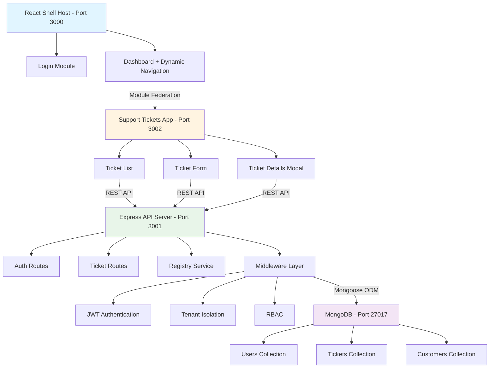

# Flowbit Platform - Multi-Tenant SaaS Application

A production-ready multi-tenant support ticket management system demonstrating modern SaaS architecture patterns, micro-frontend design, and workflow automation capabilities.

## Table of Contents

- [Overview](#overview)
- [Architecture](#architecture)
- [Features](#features)
- [Technology Stack](#technology-stack)
- [Getting Started](#getting-started)
- [Project Structure](#project-structure)
- [API Documentation](#api-documentation)
- [Multi-Tenancy](#multi-tenancy)
- [Development](#development)
- [Testing](#testing)
- [Troubleshooting](#troubleshooting)
- [Roadmap](#roadmap)

---

## Overview

Flowbit Platform is a comprehensive demonstration of enterprise-grade SaaS architecture, showcasing best practices in multi-tenant application development with strict data isolation, role-based access control, and scalable micro-frontend architecture.

### Key Highlights

- Complete data isolation at the database level
- Micro-frontend architecture using Webpack Module Federation
- RESTful API with MongoDB for flexible data modeling
- JWT-based stateless authentication with RBAC
- Real-time updates with automatic refresh
- Registry-based module system for dynamic feature loading

---

## Architecture



### Architecture Principles

- **Separation of Concerns**: Clear boundaries between frontend, backend, and data layers
- **Stateless Authentication**: JWT tokens for scalable authentication
- **Data Isolation**: Tenant ID injected at middleware level, enforced at query level
- **Micro-Frontend Pattern**: Independent deployment and versioning of UI modules
- **API-First Design**: RESTful endpoints with consistent response formats

---

## Features

### Completed (Phases 1-4)

**Multi-Tenancy**
- Complete data isolation using customerId
- Tenant-specific module registry
- Automatic tenant context injection
- Zero cross-contamination between tenants

**Authentication & Authorization**
- JWT-based stateless authentication
- Role-based access control (Admin, Agent, Customer)
- Secure password hashing with bcrypt
- Protected API routes

**Ticket Management**
- Full CRUD operations for support tickets
- Priority levels (Low, Medium, High, Critical)
- Status tracking (Open, In Progress, Resolved, Closed)
- Tenant-isolated views
- Real-time updates (3-second polling)

**Micro-Frontend Architecture**
- Webpack Module Federation for dynamic loading
- Runtime module discovery via registry
- Independent deployment of modules
- Shared dependencies optimization

**User Interface**
- Responsive design for desktop and mobile
- Clean, modern UI with intuitive navigation
- Dynamic sidebar based on tenant permissions
- Modal-based ticket details
- Form validation and error handling

### Upcoming (Phases 5-7)

- **Phase 5**: n8n workflow automation for ticket processing
- **Phase 6**: Docker containerization with docker-compose
- **Phase 7**: Unit tests, E2E tests with Cypress, CI/CD with GitHub Actions

---

## Technology Stack

**Backend**
- Node.js v18+ with Express 4.x
- MongoDB 6.x with Mongoose ODM
- JWT authentication with bcrypt
- Axios for HTTP requests

**Frontend**
- React 18.x with React Router v6
- Webpack 5 with Module Federation
- Context API for state management
- Axios for API calls

**Infrastructure**
- Docker for containerization
- MongoDB in Docker container
- Hot Module Replacement for development

---

## Getting Started

### Prerequisites

- Node.js v18.0.0 or higher
- npm v9.0.0 or higher
- Docker Desktop (latest stable version)
- Git

### Installation

**1. Clone the repository**

```bash
git clone https://github.com/suhani-prog/flowbit-platform.git
cd flowbit-platform
```

**2. Start MongoDB**

```bash
docker run -d --name mongodb -p 27017:27017 -e MONGO_INITDB_DATABASE=flowbit mongo:6

# Verify MongoDB is running
docker ps | grep mongodb
```

**3. Setup API Server**

```bash
cd packages/api
npm install
cp .env.example .env

# Edit .env with your configuration
# MONGODB_URI=mongodb://localhost:27017/flowbit
# JWT_SECRET=your-super-secret-jwt-key-change-in-production
# PORT=3001

npm run seed
npm run dev
```

**4. Setup Shell Application**

```bash
# In a new terminal
cd packages/shell
npm install
npm start
```

**5. Setup Support Tickets App**

```bash
# In another terminal
cd packages/support-tickets-app
npm install
npm start
```

### Access the Application

- Main Application: http://localhost:3000
- API Server: http://localhost:3001
- Tickets Module: http://localhost:3002

### Test Credentials

**LogisticsCo Admin**
- Email: admin@logisticsco.com
- Password: password123

**RetailGmbH Admin**
- Email: admin@retailgmbh.com
- Password: password123

---

## Project Structure

```
flowbit-platform/
├── packages/
│   ├── api/                          # Backend API
│   │   ├── src/
│   │   │   ├── config/              # Database connection
│   │   │   ├── middleware/          # Auth, RBAC, Tenant isolation
│   │   │   ├── models/              # User, Ticket, Customer schemas
│   │   │   ├── routes/              # Auth, Tickets, Registry endpoints
│   │   │   ├── services/            # Business logic
│   │   │   └── server.js            # Express app entry
│   │   ├── scripts/
│   │   │   └── seed.js              # Database seeding
│   │   └── package.json
│   │
│   ├── shell/                        # React host app
│   │   ├── src/
│   │   │   ├── components/          # Layout, Login, Sidebar
│   │   │   ├── context/             # Auth context
│   │   │   ├── services/            # API client
│   │   │   └── pages/               # Dashboard, RemoteAppLoader
│   │   └── webpack.config.js        # Module Federation host
│   │
│   └── support-tickets-app/         # Tickets micro-frontend
│       ├── src/
│       │   ├── components/          # TicketList, Form, Modal
│       │   ├── hooks/               # useTickets hook
│       │   └── App.jsx
│       └── webpack.config.js        # Module Federation remote
│
└── README.md
```

---

## API Documentation

### Authentication

**POST /api/auth/login**

Request:
```json
{
  "email": "admin@logisticsco.com",
  "password": "password123"
}
```

Response:
```json
{
  "token": "eyJhbGciOiJIUzI1NiIsInR5cCI6IkpXVCJ9...",
  "user": {
    "id": "user_id",
    "email": "admin@logisticsco.com",
    "customerId": "LogisticsCo",
    "role": "Admin"
  }
}
```

### Tickets

All endpoints require `Authorization: Bearer <token>` header.

**GET /api/tickets**
- Query params: status, priority (optional)
- Returns all tickets for authenticated user's tenant

**POST /api/tickets**
- Body: { title, description, priority }
- Creates new ticket for user's tenant

**PATCH /api/tickets/:id**
- Body: { status, priority } (partial update)
- Updates existing ticket

**DELETE /api/tickets/:id**
- Deletes ticket (Admin only)

### Registry

**GET /api/registry**
- Returns available modules for authenticated user's tenant

---

## Multi-Tenancy

### Implementation

**Tenant Isolation Strategy:**

1. Each tenant has a unique customerId
2. Middleware injects customerId into request context from JWT
3. All database queries automatically filter by customerId
4. Registry restricts modules based on tenant plan

**Database Schema:**
```javascript
// All tenant documents include customerId
{
  customerId: { type: String, required: true, index: true },
  // other fields...
}
```

### Adding a New Tenant

**Step 1: Create Customer**
```javascript
await Customer.create({
  _id: 'TechStartup',
  name: 'Tech Startup Inc.',
  plan: 'enterprise',
  features: ['tickets', 'workflows']
});
```

**Step 2: Create Admin User**
```javascript
const hashedPassword = await bcrypt.hash('password123', 10);
await User.create({
  email: 'admin@techstartup.com',
  password: hashedPassword,
  customerId: 'TechStartup',
  role: 'Admin'
});
```

**Step 3: Update Registry**

Edit `packages/api/src/registry.json`:
```json
{
  "TechStartup": [
    {
      "id": "support-tickets",
      "name": "Support Tickets",
      "url": "http://localhost:3002/remoteEntry.js",
      "scope": "supportTicketsApp",
      "module": "./App"
    }
  ]
}
```

---

## Development

### Running in Development

All packages support hot module replacement:

```bash
# Terminal 1 - API with nodemon
cd packages/api && npm run dev

# Terminal 2 - Shell with HMR
cd packages/shell && npm start

# Terminal 3 - Tickets with HMR
cd packages/support-tickets-app && npm start
```

### Environment Variables

Create `packages/api/.env`:
```env
MONGODB_URI=mongodb://localhost:27017/flowbit
JWT_SECRET=your-secret-key-min-32-chars
JWT_EXPIRY=24h
PORT=3001
NODE_ENV=development
ALLOWED_ORIGINS=http://localhost:3000,http://localhost:3002
```

---

## Testing

### Manual Testing Checklist

**Tenant Isolation:**
- Login as LogisticsCo admin, create ticket
- Login as RetailGmbH admin, verify ticket not visible
- Confirm complete data isolation

**Authentication:**
- Valid credentials succeed
- Invalid credentials fail
- Expired token redirects to login

**Ticket Operations:**
- Create ticket with all fields
- Update ticket status and priority
- Delete ticket (Admin only)
- Filter tickets by status/priority

---

## Troubleshooting

### Port Already in Use

```bash
# Windows
netstat -ano | findstr :3000
taskkill /PID <PID> /F

# macOS/Linux
lsof -ti:3000 | xargs kill -9
```

### MongoDB Connection Failed

```bash
# Check container status
docker ps

# Start MongoDB
docker start mongodb

# Check logs
docker logs mongodb
```

### Module Federation Error

1. Ensure tickets app runs on port 3002
2. Verify remoteEntry.js accessible at http://localhost:3002/remoteEntry.js
3. Check browser console for CORS errors
4. Clear cache and restart dev servers

### CORS Errors

1. Verify all services run on correct ports
2. Check CORS configuration in `packages/api/src/server.js`
3. Ensure ALLOWED_ORIGINS includes all frontend URLs

---

## Roadmap

**Phase 5: n8n Integration**
- Workflow automation for ticket processing
- Email notifications
- Auto-assignment based on priority
- Escalation for overdue tickets

**Phase 6: Docker & Production**
- Dockerfiles for all services
- docker-compose for local and production
- nginx reverse proxy
- Environment-specific builds

**Phase 7: Testing & CI/CD**
- Unit tests with Jest
- Integration tests for auth flow
- E2E tests with Cypress
- GitHub Actions workflow
- Automated deployment

---

## License

MIT License - See LICENSE file for details

---

## Author

**Suhani Pandey**

- GitHub: https://github.com/suhani-prog
- Email: pandeysuhani30@gmail.com

---

## Acknowledgments

Built as a technical challenge to demonstrate:
- Multi-tenant SaaS architecture
- Micro-frontend patterns with Module Federation
- Workflow automation integration
- Modern full-stack development practices
